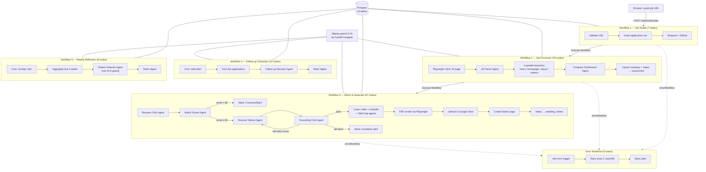

# Anchor

**Paste a job URL. Get a tailored, fact-checked application packet in 8 minutes instead of 90.**


---

## The Problem

I'm a CS undergrad applying for 2026 internships. Every application is the same grind: read the JD, research the company, figure out which resume bullets matter, rewrite them, draft a cover letter that doesn't sound generic, check that I haven't accidentally inflated anything. Repeat for 20-50 applications. ~90 minutes each, most of it mechanical.

The bigger problem: every "AI resume tailor" tool I tried **hallucinated experience I don't have**. They'd add technologies I've never used, inflate "contributed to" into "led," invent metrics. That's worse than not tailoring at all — it's dishonest.

Anchor solves both: it automates the mechanical parts (research, matching, drafting) while enforcing a **structural constraint** that makes hallucination architecturally impossible. Every line in a tailored resume must cite a specific source entry by foreign key. If the AI invents something, the system catches it before anything ships.

## What It Does

- **URL → full application packet.** Paste a LinkedIn/Greenhouse/Lever/Workday URL into the dashboard. The pipeline scrapes the JD, researches the company from 4 parallel sources, scores your match, tailors your resume, writes a cover letter + LinkedIn message, generates a skill-gap report, renders PDFs, uploads to Google Drive, and creates a Notion page — all automatically.

- **Match scoring with a human gate.** An AI critic scores how well your resume fits the JD (0-100). Below 60, the pipeline pauses and sends a Slack message asking whether to continue or skip. You decide, not the AI.

- **Grounded generation, not hallucination.** Your resume is stored as structured Postgres rows (`master_resume_entry`), not a text blob. The tailorer selects and rephrases from these rows. An adversarial Grounding Critic agent verifies every output line against its cited source. See [Grounding & Reliability](#grounding--reliability).

- **Application tracking dashboard.** A Next.js kanban board where you track every application through the lifecycle: intake → researched → awaiting review → submitted → responded → interview → outcome. Click any card to see all generated materials, match analysis, company research, and add notes.

- **Full observability.** Every AI agent call (11 per application) is logged to Postgres with structured output, input hash, and timestamps. The Decisions page shows exactly what the AI decided and why.

- **Follow-up scheduling + pattern detection.** A daily cron drafts follow-up nudges for submitted applications past their window. A weekly cron detects patterns across your applications (e.g., "you score higher on backend roles than PM roles") once you have 5+ in the system.

## Screenshots

**Dashboard** — Next.js 14, direct Postgres queries, JWT auth:

| Application Kanban | Application Detail (click any card) |
|---|---|
|  |  |

**n8n Workflows** — 6 workflows, 127 nodes total:

| Workflow 3: Match & Generate (67 nodes) | Workflow 2: Job Processor (25 nodes) |
|---|---|
|  |  |

More: [Error Handler](docs/canvas-screenshots/00_error_handler.png) · [Job Intake](docs/canvas-screenshots/01_job_intake.png) · [Follow-up Scheduler](docs/canvas-screenshots/04_follow_up_scheduler.png) · [Weekly Reflection](docs/canvas-screenshots/05_weekly_reflection.png) · [Welcome Page](docs/canvas-screenshots/dashboard_welcome.png)

## Architecture



## Workflow Breakdown

| # | Workflow | Trigger | Nodes | What it does | Output |
|---|---|---|---|---|---|
| 0 | **Error Handler** | n8n error trigger | 6 | Retries transient failures (max 2, 2s backoff), posts Slack alert with execution URL on permanent failure | `application_event` row, Slack alert |
| 1 | **Job Intake** | Webhook `POST /webhook/intake` | 7 | Validates URL format, detects ATS host (Greenhouse/Lever/Workday), inserts `application` row, responds under 500ms, fires Workflow 2 async | `application` row (`intake_received`) |
| 2 | **Job Processor** | Execute Workflow (from 1) | 25 | Playwright JD fetch → JD Parser agent → derives research URLs → 4 parallel fetch branches (news, homepage, about, careers — each failure-tolerant) → Company Synthesizer agent → upsert `company` with full synthesis | `company` row with `synthesis` JSONB, `application` status → `researched` |
| 3 | **Match & Generate** | Execute Workflow (from 2) | 67 | Resume Critic → Match Scorer (gate at 60 with Slack + human-in-loop Wait) → Resume Tailorer → Grounding Critic (1 retry, then escalate) → Cover Letter / LinkedIn / Skill Gap agents → PDF render → Google Drive folder + upload → Notion page → Slack "ready" | 4 `generated_material` rows, 2 PDFs in Drive, 1 Notion page |
| 4 | **Follow-up Scheduler** | Cron, daily 8am | 14 | Marks 21-day-old applications `ghosted`, finds submitted apps past their nudge window, runs Follow-up Decision agent per app, persists nudge drafts, posts Slack digest | `generated_material` type `follow_up_nudge`, `application_event` |
| 5 | **Weekly Reflection** | Cron, Sunday 7pm | 8 | Aggregates last 4 weeks of applications, runs Pattern Detector agent (min-N=5 guard prevents speculation on small samples), posts Slack digest | `weekly_insight` row |

All workflow JSON exports: [`n8n/workflows/`](n8n/workflows/)

## Grounding & Reliability

This is Anchor's core architectural bet. The problem: LLMs freely invent experience when asked to "tailor this resume." The solution is a 3-layer enforcement system:

**Layer 1 — Structural grounding.** The master resume is decomposed into individual `master_resume_entry` rows in Postgres (not a text blob — [ADR-006](docs/decisions/006-master-resume-structured-not-text.md)). Each row has a UUID, a `canonical_text` paragraph, structured `facts` (JSONB), tags, and a priority. The Resume Tailorer must cite a `master_resume_entry_id` for every line it outputs. The pipeline validates that every cited ID actually exists in the database.

**Layer 2 — Semantic verification.** An adversarial Grounding Critic agent receives each tailored line paired with its cited source entry and checks whether the tailored version adds anything not present in the source: new technologies, inflated numbers, stronger role titles. If it finds violations, the tailored resume is rejected.

**Layer 3 — Retry with feedback, then escalate.** On a first grounding failure, the violations are fed back to the Resume Tailorer as revision instructions. If the second attempt also fails, the pipeline escalates to Slack (human review) rather than shipping unverified content. No material is ever persisted to `generated_material` without clearing the grounding check.

The `material_grounding` join table records which `master_resume_entry` rows were cited in each generated material, creating an auditable FK trail from output back to source.

## Observability

Every AI agent call across all workflows writes an `agent_run` row to Postgres:

| Field | What it captures |
|---|---|
| `application_id` | Which application this run belongs to |
| `workflow_name` | Which n8n workflow triggered it |
| `agent_name` | Which agent (`jd_parser`, `match_scorer`, `grounding_critic`, etc.) |
| `output_json` | The agent's full structured output (JSONB) |
| `input_hash` | SHA-256 of the prompt sent to the LLM |
| `latency_ms` | How long the LLM call took |
| `critic_passed` | Boolean — did this agent's output pass its quality check |

The dashboard's **Decisions** page surfaces this as an expandable audit log. For any application, you can see exactly what each of the 11 agents decided, what data it saw, and whether the critic approved it. This matters for debugging multi-agent pipelines where one bad upstream output cascades through 5 downstream agents.

## Evaluation

20 synthetic job applications (spanning good/medium/poor fit) were run through Anchor's full 11-agent chain and through a naive single-prompt baseline with no critic and no grounding instructions. Both outputs were checked by the same Grounding Critic agent.

| | Grounding pass rate | Violations (total) |
|---|---|---|
| **Anchor** (11-agent chain + Grounding Critic, 1 retry) | **10% (2/20)** | 74 |
| **Baseline** (single prompt, no critic) | **0% (0/20)** | 53 |

Mean match score: 74.2/100. Tier distribution: 8 hot (≥75), 11 warm (60–74), 1 cold (<60).

The 10% pass rate reflects the grounding system working correctly against qwen2.5:7b's tendency to paraphrase aggressively — the critic catches violations that would otherwise ship silently. The architecture is designed for stronger models (GPT-4, Claude) where the pass rate would be significantly higher; qwen2.5:7b was chosen to keep the build zero-cost ([ADR-002](docs/decisions/002-ollama-local-not-paid-api.md)).

Full detail: [eval/results_summary.md](eval/results_summary.md) · [eval/grading_rubric.md](eval/grading_rubric.md)

## Setup

**Prerequisites:** macOS (Homebrew), PostgreSQL 16, Node.js ≥ 18, Python 3.11+, Ollama with `qwen2.5:7b` pulled.

### 1. Postgres
```bash
brew services start postgresql@16
export PATH="/opt/homebrew/opt/postgresql@16/bin:$PATH"
createdb anchor
psql -d anchor -f db/schema.sql
psql -d anchor -f db/seed_master_resume.sql
```

### 2. Environment
```bash
cp .env.example .env          # configure SLACK_WEBHOOK_URL, ports
```

### 3. LLM wrapper
```bash
python3 -m venv .venv
.venv/bin/pip install -r llm/requirements.txt
.venv/bin/uvicorn llm.server:app --port 8001
```

### 4. Fetch/PDF service
```bash
.venv/bin/pip install -r fetch/requirements.txt
.venv/bin/uvicorn fetch.server:app --port 8002
```

### 5. n8n
```bash
npx n8n start   # http://localhost:5678
# Import workflows from n8n/workflows/*.json
# Configure credentials: Postgres, Google Drive OAuth2, Notion API
```

### 6. Dashboard
```bash
cd dashboard
cp .env.local.example .env.local   # set DATABASE_URL, JWT_SECRET, ADMIN credentials
npm install
npm run dev   # http://localhost:3000
```

## Project Structure

```
anchor/
├── n8n/workflows/           6 exported workflow JSON files (127 nodes total)
├── prompts/                 12 versioned agent prompts (.md)
├── llm/                     FastAPI wrapper around Ollama (disk cache, /complete endpoint)
├── fetch/                   Playwright microservice (JD fetch + PDF render)
├── pdf/templates/           Jinja2 HTML templates for resume + cover letter PDFs
├── db/                      schema.sql (10 tables), migrations/, seed data
├── dashboard/               Next.js 14 App Router (login, kanban, detail, setup, audit log)
├── eval/                    20×2 eval outputs, benchmark script, results summary
└── docs/
    ├── planning/            anchor_planning.md (authoritative spec)
    ├── decisions/           6 ADRs
    └── canvas-screenshots/  10 PNGs (workflows + dashboard)
```

## Design Decisions

| ADR | Decision | Alternative rejected |
|---|---|---|
| [001](docs/decisions/001-n8n-not-custom-python.md) | n8n for orchestration | Custom Python DAG |
| [002](docs/decisions/002-ollama-local-not-paid-api.md) | Ollama (local, free) | Paid LLM APIs |
| [003](docs/decisions/003-postgres-single-source-of-truth.md) | Postgres as single source of truth | n8n static data |
| [004](docs/decisions/004-manual-url-paste-not-scraping.md) | Manual URL paste | Job board scraping |
| [005](docs/decisions/005-anchor-drafts-i-send.md) | Anchor drafts; I send manually | Auto-submit |
| [006](docs/decisions/006-master-resume-structured-not-text.md) | Structured resume rows | Text blob |

## Roadmap

- **Multi-user support** — sign-up, per-user data isolation, `user_id` on all tables
- **Resume profiles** — multiple resume variants (AI/ML, PM, Backend) with profile selector on intake
- **Stronger LLM backend** — config switch for Claude/GPT-4 API to improve grounding pass rate and resume completeness
- **Docker deployment** — `docker compose up` for Postgres + n8n + LLM wrapper + fetch service + dashboard

See [FUTURE.md](FUTURE.md) for the full list.

## License

Personal project, not licensed for redistribution. Built for the 2026 internship search.
