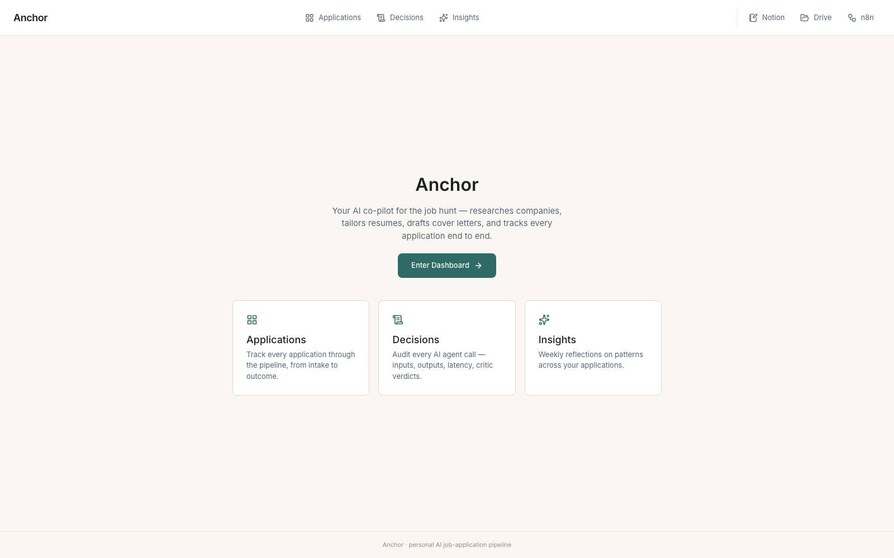
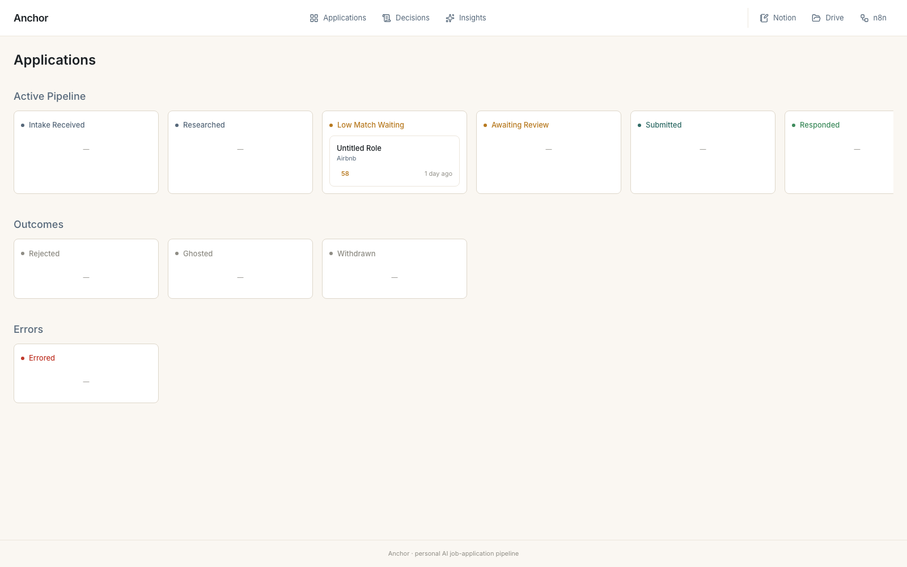
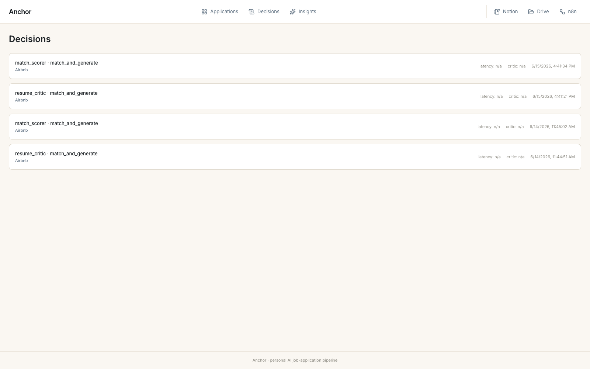
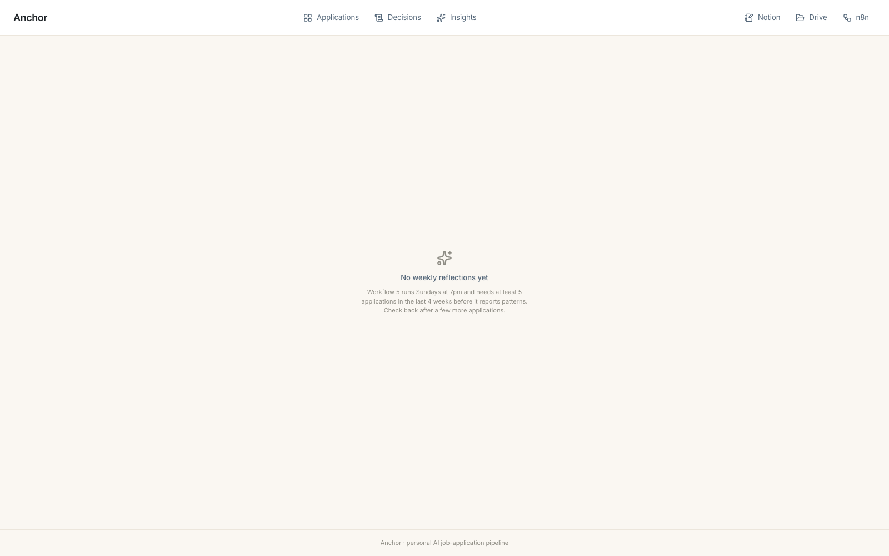
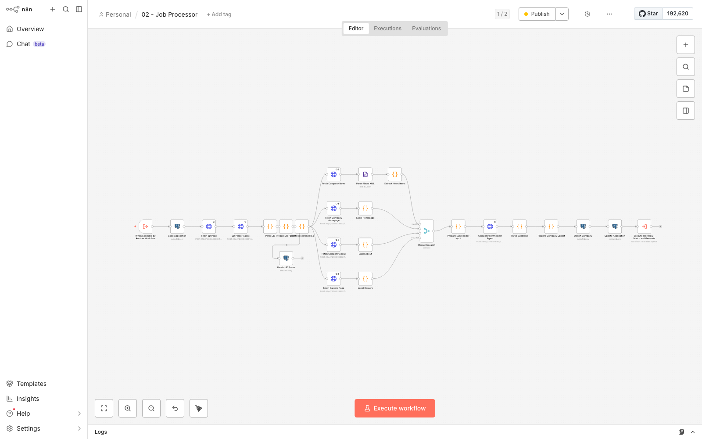
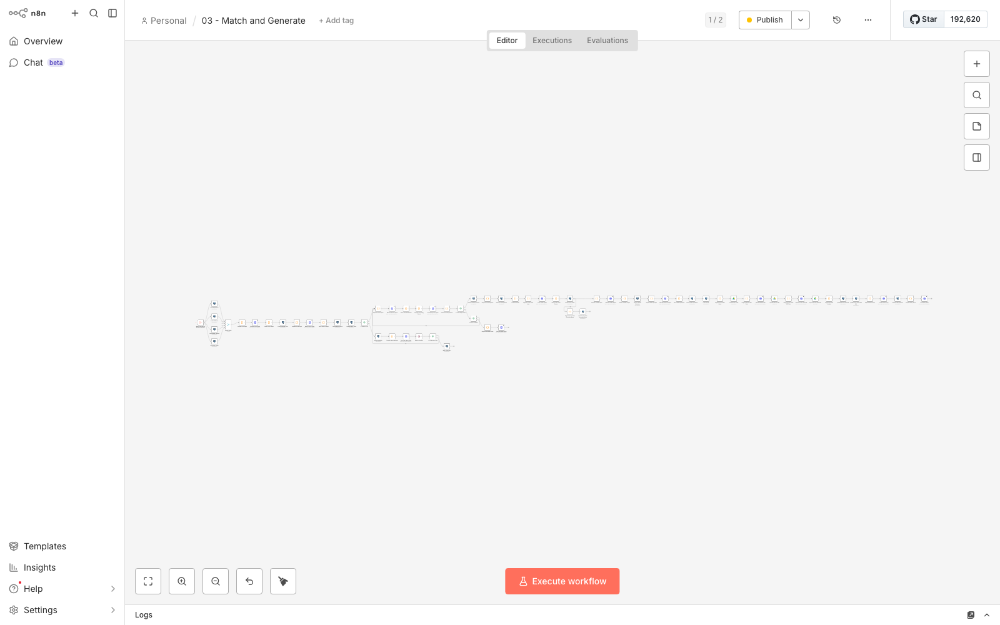

# Anchor

A personal, n8n-orchestrated AI pipeline that takes a job-posting URL and produces a
researched, **factually-grounded** application — tailored resume, cover letter,
LinkedIn message, and skill-gap report — ready for review in Notion. Built for the
2026 internship search; replaces ~90 minutes of manual tailoring work per application
with ~8 minutes of review.

Full design: [`docs/planning/anchor_planning.md`](docs/planning/anchor_planning.md)
(authoritative — supersedes `anchor_phase_0.md`, kept only for history).

## Status

**Day 18 of 18.** All 5 n8n workflows + the error workflow are built and live;
dashboard running with job-URL intake form + master-resume setup page; Material
Quality eval complete (20 applications, Anchor vs single-prompt baseline). See
[CLAUDE.md](CLAUDE.md) for the day-by-day build log and
[eval/results_summary.md](eval/results_summary.md) for the eval results.

## Why this exists

Generated resumes hallucinate experience — that's the headline failure mode of
"tailor my resume to this JD" tools. Anchor's core architectural bet is the same one
that made [Meridian](../meridian)'s research citations trustworthy, applied to
*generation* instead of research: decompose the master resume into structured,
addressable facts (`master_resume_entry` rows), make tailoring a **selection +
rephrasing** operation over those facts, and run an adversarial Grounding Critic over
every output before it ships. See [ADR-006](docs/decisions/006-master-resume-structured-not-text.md).

Every other design choice — n8n over custom orchestration, Postgres as the single
source of truth, manual URL paste instead of scraping, "Anchor drafts, I send" — is
recorded as an ADR in [`docs/decisions/`](docs/decisions/).

## Architecture

```
┌─────────────────────────────────────────────────────────────┐
│  ME (browser, manually paste URL)                            │
└────────────────────────────┬──────────────────────────────────┘
                              │ HTTP POST /webhook/intake
                              ▼
┌─────────────────────────────────────────────────────────────┐
│  Workflow 1 — JOB INTAKE                                       │
│  Validate URL → insert application (intake_received) →        │
│  respond <500ms → Execute Workflow 2 (async)                   │
└────────────────────────────┬──────────────────────────────────┘
                              ▼
┌─────────────────────────────────────────────────────────────┐
│  Workflow 2 — JOB PROCESSOR                                    │
│  Playwright JD fetch → JD Parser agent → 4 parallel research   │
│  branches (news/homepage/about/careers) → Company Synthesizer  │
│  → status: researched → Execute Workflow 3                     │
└────────────────────────────┬──────────────────────────────────┘
                              ▼
┌─────────────────────────────────────────────────────────────┐
│  Workflow 3 — MATCH & GENERATE                                 │
│  Resume Critic → Match Scorer (gate @ 60: < 60 → Slack +       │
│  Wait for human decision) → Resume Tailorer → Grounding Critic │
│  (1 retry, then escalate) → Cover Letter / LinkedIn / Skill    │
│  Gap agents → PDF render → Drive + Notion → status:            │
│  awaiting_review                                                │
└─────────────────────────────────────────────────────────────┘

┌─────────────────────────────────────────────────────────────┐
│  Workflow 4 — FOLLOW-UP SCHEDULER (cron, daily 8am)            │
│  Find submitted apps past their nudge window → Follow-up       │
│  Decision agent → draft nudge → Slack digest for review        │
└─────────────────────────────────────────────────────────────┘

┌─────────────────────────────────────────────────────────────┐
│  Workflow 5 — WEEKLY REFLECTION (cron, Sun 7pm)                │
│  Aggregate last 4 weeks → Pattern Detector agent (min-N=5      │
│  guard) → Slack digest → weekly_insight                         │
└─────────────────────────────────────────────────────────────┘

         ┌───────────────────────────────────────────┐
         │  ERROR WORKFLOW (n8n error trigger)        │
         │  Retry transient errors (max 2, backoff)   │
         │  → Slack alert on permanent failure        │
         │  → status: errored                          │
         └───────────────────────────────────────────┘
```

| Workflow | Trigger | Does | Exported |
|---|---|---|---|
| 1. Job Intake | Webhook `/webhook/intake` | Validate URL, insert `application` row, respond, hand off | [01_job_intake.json](n8n/workflows/01_job_intake.json) |
| 2. Job Processor | Execute Workflow | JD fetch + parse, parallel company research, synthesis | [02_job_processor.json](n8n/workflows/02_job_processor.json) |
| 3. Match & Generate | Execute Workflow | Critic → Score gate → Tailor → Ground → Generate → Export | [03_match_and_generate.json](n8n/workflows/03_match_and_generate.json) |
| 4. Follow-up Scheduler | Cron, daily 8am | Draft follow-up nudges for review | [04_follow_up_scheduler.json](n8n/workflows/04_follow_up_scheduler.json) |
| 5. Weekly Reflection | Cron, Sun 7pm | Pattern detection across recent applications | [05_weekly_reflection.json](n8n/workflows/05_weekly_reflection.json) |
| Error workflow | n8n error trigger | Retry + Slack alert + status update | [00_error_handler.json](n8n/workflows/00_error_handler.json) |

All AI agent calls go through a local FastAPI wrapper around Ollama (`qwen2.5:7b`,
[ADR-002](docs/decisions/002-ollama-local-not-paid-api.md)) — no paid LLM APIs.
Postgres ([`db/schema.sql`](db/schema.sql), 10 tables) is the single source of truth
for all application/company/material state
([ADR-003](docs/decisions/003-postgres-single-source-of-truth.md)).

## Screenshots

**Dashboard** — Next.js app querying Postgres directly
([ADR-003](docs/decisions/003-postgres-single-source-of-truth.md), "the dashboard is
just SQL"):

| Welcome | Applications kanban |
|---|---|
|  |  |

| Decisions audit log | Weekly insights |
|---|---|
|  |  |

**n8n workflow canvases**:

| Workflow 2 — Job Processor | Workflow 3 — Match & Generate |
|---|---|
|  |  |

More canvases: [00 — Error Handler](docs/canvas-screenshots/00_error_handler.png) ·
[01 — Job Intake](docs/canvas-screenshots/01_job_intake.png) ·
[04 — Follow-up Scheduler](docs/canvas-screenshots/04_follow_up_scheduler.png) ·
[05 — Weekly Reflection](docs/canvas-screenshots/05_weekly_reflection.png)

## Evaluation (Day 15/16 — Material Quality)

Per planning doc §10.1: 20 standalone applications (fictional companies, spanning
good/medium/poor fit for the seeded resume) were run through Anchor's full chain
(Resume Critic → Match Scorer → Resume Tailorer → Grounding Critic with 1 retry →
Cover Letter → LinkedIn → Skill Gap) and through a naive single-prompt baseline with
no critic and no grounding instructions. Both are checked by the same Grounding
Critic agent — Anchor against the *single cited entry* each line claims, the baseline
against the candidate's *full resume*.

**Headline metric — factual grounding pass rate:**

<!-- EVAL_TABLE_START -->
| | Grounding pass rate | Violations (total) |
|---|---|---|
| **Anchor** (11-agent chain + Grounding Critic, 1 retry) | **10% (2/20)** | 74 |
| **Baseline** (single prompt, no critic) | **0% (0/20)** | 53 |

Mean match score: 74.2/100. Tier distribution: 8 hot (≥75), 11 warm (60–74), 1 cold (<60).
<!-- EVAL_TABLE_END -->

Full methodology, rubric, and per-application detail:
[eval/grading_rubric.md](eval/grading_rubric.md),
[eval/results_summary.md](eval/results_summary.md),
[eval/scores_template.csv](eval/scores_template.csv).

## Design decisions (ADRs)

- [001 — n8n, not custom Python](docs/decisions/001-n8n-not-custom-python.md)
- [002 — Ollama local, not paid API](docs/decisions/002-ollama-local-not-paid-api.md)
- [003 — Postgres as single source of truth](docs/decisions/003-postgres-single-source-of-truth.md)
- [004 — Manual URL paste, not scraping](docs/decisions/004-manual-url-paste-not-scraping.md)
- [005 — Anchor drafts; I send](docs/decisions/005-anchor-drafts-i-send.md)
- [006 — Master resume as structured data](docs/decisions/006-master-resume-structured-not-text.md)

## Local Setup (native — Docker deferred)

### 1. Postgres
```bash
brew install postgresql@16
brew services start postgresql@16
export PATH="/opt/homebrew/opt/postgresql@16/bin:$PATH"
createdb anchor
psql -d anchor -f db/schema.sql
psql -d anchor -f db/seed_master_resume.sql   # seeds master_resume_entry + user_profile
```

### 2. LLM wrapper (Ollama + FastAPI + disk cache)
Requires Ollama running locally with `qwen2.5:7b` pulled (`ollama pull qwen2.5:7b`).

```bash
~/.pyenv/versions/3.11.9/bin/python3 -m venv .venv
.venv/bin/pip install -r llm/requirements.txt
.venv/bin/uvicorn llm.server:app --reload --port 8001
curl localhost:8001/health
```

### 3. Fetch/PDF service (Playwright)
```bash
.venv/bin/uvicorn fetch.server:app --reload --port 8002
```

### 4. n8n
```bash
npx n8n start   # editor at http://localhost:5678
```

### 5. Dashboard
```bash
cd dashboard
cp .env.local.example .env.local   # set DATABASE_URL
npm install
npm run dev   # http://localhost:3000
```

Copy `.env.example` → `.env` for n8n/LLM-wrapper config (gitignored).

## Folder structure

```
anchor/
├── n8n/workflows/        ← exported workflow JSON, numbered 00-05
├── db/                    ← schema.sql, migrations/, seed data
├── prompts/               ← one .md per agent
├── llm/                   ← Ollama wrapper (FastAPI)
├── fetch/                 ← Playwright JD-fetch + PDF-render microservice
├── pdf/templates/         ← resume.html, cover_letter.html
├── dashboard/             ← Next.js: kanban, decisions audit log, insights
├── eval/                  ← Material Quality eval (Day 15/16)
└── docs/
    ├── planning/          ← anchor_planning.md (authoritative)
    ├── decisions/         ← ADRs
    └── canvas-screenshots/
```

## Non-goals

Anchor doesn't scrape job boards, auto-submit applications, have user accounts, or
help anyone other than its one user. Full list in planning doc §17. Every "what if it
also..." idea is parked in [FUTURE.md](FUTURE.md), not built.
